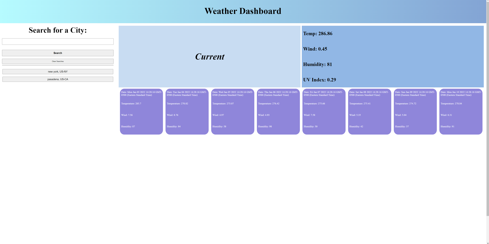

# Weather Dashboard

This repository contains the HTML, CSS and JavaScript code for the Weather Dashboard Project.

## Table of Contents

[description](#description)  
[features](#features)  
[how it works](#how-it-works)
[installation](#installation)  
[contact](#contact)  
[license](#license)

## Description

Weather dashboard was created so that users can obtain weather for any city in the United States. While this served as a great introductory experience to third-party APIs, I believe there exists significant room for improvement in this application, including:

- Refactoring the codebase to adhere more closely to the SOLID framework for better readability and maintainability.
- Fixing formatting in some areas to prevent element overlap and to make the application more mobile-friendly. Also, the format in which dates are displayed could be more user-friendly.
- Expanded customization for users. For example, in its current build, the application only allows users to view a seven day forecast.
- More robust user input validation.

## Features

In its current build, Weather Dashboard allows users to:

- Fetch data from the Open Weather Map API
- View a seven-day weather forecast for a city of their choosing
- View temperature, wind, UVI and humidity data for each day in the forecast

## How it Works

When a user submits a search, an event listener fires that calls a series of functions that perform the following actions:

- User input is taken from the search box element and separated into city and state components. These are then formatted with string methods.
- User input is then saved into local storage. A separate function reads local storage and displays past search history below the search bar.
- User input is then integrated into an Open Weather Map url that is used to fetch data from the API.
- This data is then displayed in tile format.

In addition, UV index data is conditionally formatted based on its severity. Users also have the option to clear search history by selecting the "clear" button adjacent to the "search" button.

## Installation

No installation required. Simply follow the link below:

https://rrich-kray.github.io/weather-dashboard/

## Contact

GitHub profile:

https://github.com/rrich-kray/

Email inquiries:

rrich.kray.93@gmail.com

## License

Copyright (c) 2022, Ryan Kray
All rights reserved.

This source code is licensed under the BSD-style license found in the LICENSE file in the root directory of this source tree and reproduced below.

Redistribution and use in source and binary forms, with or without modification, are permitted provided that the following conditions are met:

1. Redistributions of source code must retain the above copyright notice, this list of conditions and the following disclaimer.
2. Redistributions in binary form must reproduce the above copyright notice, this list of conditions and the following disclaimer in the documentation and/or other materials provided with the distribution.
3. All advertising materials mentioning features or use of this software must display the following acknowledgement: This product includes software developed by Ryan Kray.
4. Neither the name of this application's developer nor the names of its contributors may be used to endorse or promote products derived from this software without specific prior written permission.

THIS SOFTWARE IS PROVIDED BY THE COPYRIGHT HOLDER ''AS IS'' AND ANY EXPRESS OR IMPLIED WARRANTIES, INCLUDING, BUT NOT LIMITED TO, THE IMPLIED WARRANTIES OF MERCHANTABILITY AND FITNESS FOR A PARTICULAR PURPOSE ARE DISCLAIMED. IN NO EVENT SHALL THE COPYRIGHT HOLDER OR CONTRIBUTORS BE LIABLE FOR ANY DIRECT, INDIRECT, INCIDENTAL, SPECIAL, EXEMPLARY, OR CONSEQUENTIAL DAMAGES (INCLUDING, BUT NOT LIMITED TO, PROCUREMENT OF SUBSTITUTE GOODS OR SERVICES; LOSS OF USE, DATA, OR PROFITS; OR BUSINESS INTERRUPTION) HOWEVER CAUSED AND ON ANY THEORY OF LIABILITY, WHETHER IN CONTRACT, STRICT LIABILITY, OR TORT (INCLUDING NEGLIGENCE OR OTHERWISE) ARISING IN ANY WAY OUT OF THE USE OF THIS SOFTWARE, EVEN IF ADVISED OF THE POSSIBILITY OF SUCH DAMAGE.
