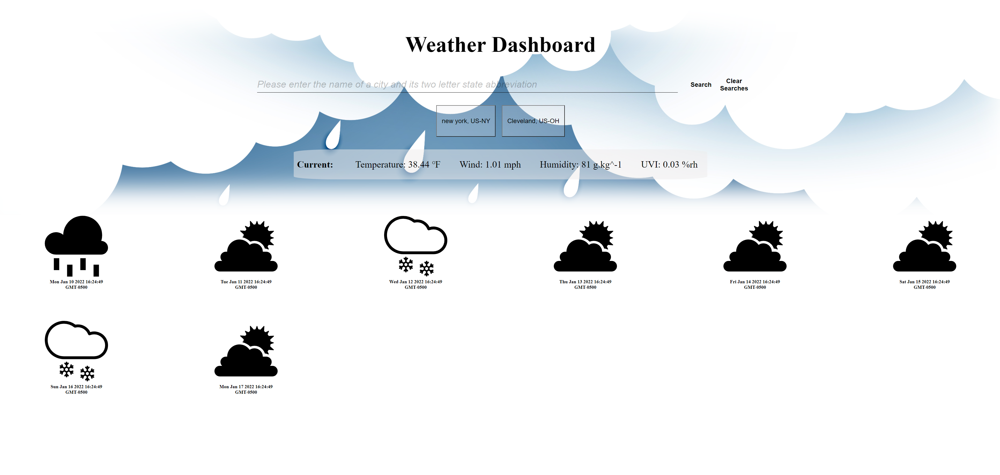
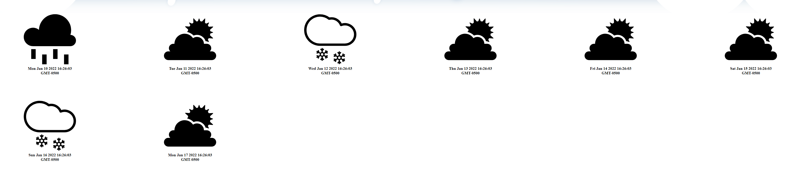

# Weather Dashboard

## The Repository

This repository contains the HTML, CSS and Javascript code for the Weather Dashboard Project.

## Weather Dashboard

Weather dashboard makes it easy to obtain current and forecasted weather conditions for a desired city.  

## Usage

Users can pull weather data by using the search box shown below. Please note that input therein must in [city], [state] format.

User searches are saved in the browser's local storage and displayed directly below the search box and button. Clicking on any of these past searches will pull the current and forecasted weather data for the past search.

The "Clear Searches" button located directly below the search button clears local storage of any past user searches. 

Clicking the search button will populate the current conditions section with weather data pertaining to the user's search, as well as span a weather tile for each of the next seven days.

## Deployed Application

the deployed application can be found by following the link below.

https://rrich-kray.github.io/weather-dashboard/

## Feedback

Leave comments/suggestions in the Slack channel!

## License

Copyright &copy; Weather Dashboard, Inc. All rights reserved.